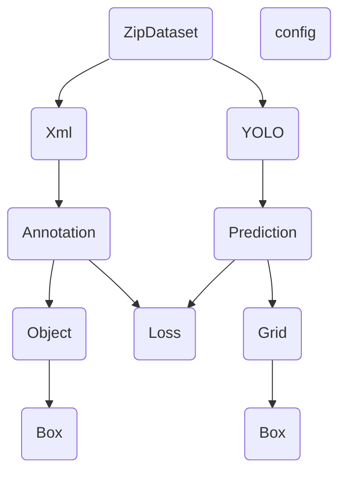

# 数据集下载地址

https://www.kaggle.com/competitions/imagenet-object-localization-challenge/data

数据集文件目录

```
imagenet-object-localization-challenge.zip
├─ILSVRC
│ ├─Annotations
│ │ └─CLS-LOC
│ │   ├─train
│ │   │ ├─n01440764
│ │   │ │ ├─n01440764_18.xml
│ │   │ │ ├─n01440764_37.xml
│ │   │ │ ├─n01440764_39.xml
│ │   │ │ └─...
│ │   │ ├─n01443537
│ │   │ ├─n01484850
│ │   │ └─...
│ │   └─val
│ │     ├─ILSVRC2012_val_00000001.xml
│ │     ├─ILSVRC2012_val_00000002.xml
│ │     ├─ILSVRC2012_val_00000003.xml
│ │     └─...
│ ├─Data
│ │ └─CLS-LOC
│ │   ├─test
│ │   │  ├─ILSVRC2012_test_00000001.JPEG
│ │   │  ├─ILSVRC2012_test_00000002.JPEG
│ │   │  ├─ILSVRC2012_test_00000003.JPEG
│ │   │  └─...
│ │   ├─train
│ │   │ ├─n01440764
│ │   │ │ ├─n01440764_18.JPEG
│ │   │ │ ├─n01440764_37.JPEG
│ │   │ │ ├─n01440764_39.JPEG
│ │   │ │ └─...
│ │   │ ├─n01443537
│ │   │ ├─n01484850
│ │   │ └─...
│ │   └─val
│ │     ├─ILSVRC2012_val_00000001.JPEG
│ │     ├─ILSVRC2012_val_00000002.JPEG
│ │     ├─ILSVRC2012_val_00000003.JPEG
│ │     └─...
│ └─ImageSets
│   └─CLS-LOC
│     ├─test.txt
│     ├─train_cls.txt
│     ├─train_loc.txt
│     └─val.txt
├─LOC_sale_submission.csv
├─LOC_synset_mapping.txt
├─LOC_train_solution.csv
└─LOC_val_solution.csv
```
# Todo list

1.自定义DataLoader,需要将image和xml一一对应然后输出，

之后将image转化成(batch_size,3,448,448)的tensor，

label需要读取xml文件，然后转化成(batch_size,4)的tensor,

2.损失函数需要用到IOU找到responsible box

然后用responsible box更新损失

3.将Loss Model中的各个参数统一用config替换

4.YOLO论文中给出20个参数用于检测类别，但是ILSVRC数据集的类别有成千上百个，

所以一个办法是训练另一个模型，以这20个参数为输入，输出为1个类别以及confidence

但是这里还未想好怎么实现，并且现阶段的目标只是让YOLO知道哪个网格里有东西，这个东西有多大

所以等到之后有机会再实现，所以目前损失函数缺少了分类损失


# 数据定义
1.模型的输出：为(batch_size,1470)大小的tensor,转为(batch_size,7,7,30)的Tensor

代表7*7的grid，最后一维0-4,5-9依次对应x,y,w,h,confidence,10-29对应class_probability

2.targets: 为(batch_size,4*n)大小的tensor，最后一维依次对应(x,y,w,h)*n个检测框,


# 数据处理流程
