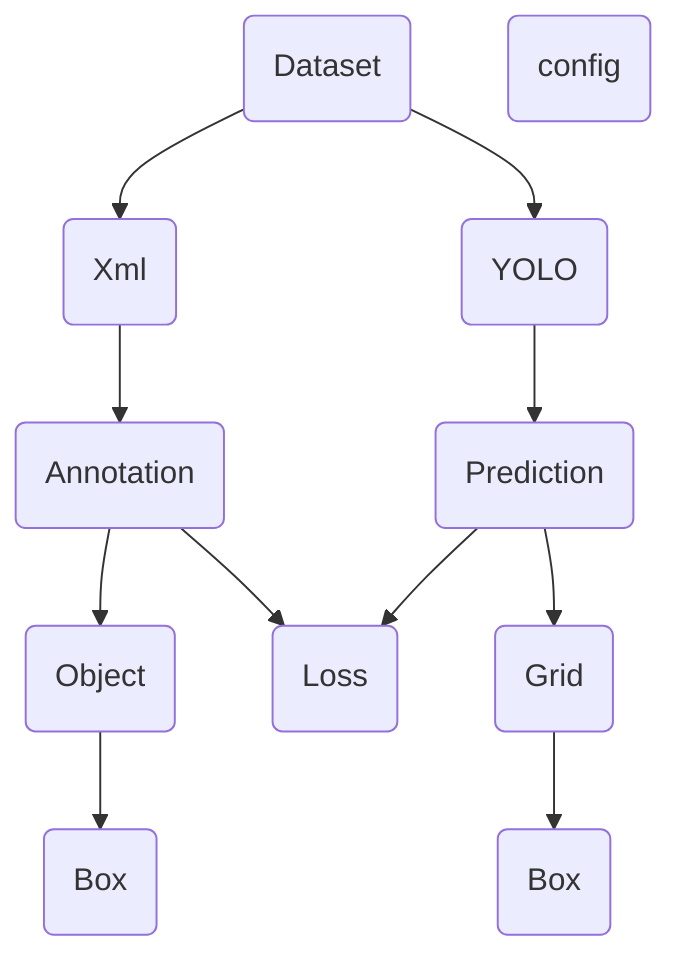

# 数据集下载地址

https://www.kaggle.com/competitions/imagenet-object-localization-challenge/data

数据集文件目录

```
imagenet-object-localization-challenge.zip
├─ILSVRC
│ ├─Annotations
│ │ └─CLS-LOC
│ │   ├─train
│ │   │ ├─n01440764
│ │   │ │ ├─n01440764_18.xml
│ │   │ │ ├─n01440764_37.xml
│ │   │ │ ├─n01440764_39.xml
│ │   │ │ └─...
│ │   │ ├─n01443537
│ │   │ ├─n01484850
│ │   │ └─...
│ │   └─val
│ │     ├─ILSVRC2012_val_00000001.xml
│ │     ├─ILSVRC2012_val_00000002.xml
│ │     ├─ILSVRC2012_val_00000003.xml
│ │     └─...
│ ├─Data
│ │ └─CLS-LOC
│ │   ├─test
│ │   │  ├─ILSVRC2012_test_00000001.JPEG
│ │   │  ├─ILSVRC2012_test_00000002.JPEG
│ │   │  ├─ILSVRC2012_test_00000003.JPEG
│ │   │  └─...
│ │   ├─train
│ │   │ ├─n01440764
│ │   │ │ ├─n01440764_18.JPEG
│ │   │ │ ├─n01440764_37.JPEG
│ │   │ │ ├─n01440764_39.JPEG
│ │   │ │ └─...
│ │   │ ├─n01443537
│ │   │ ├─n01484850
│ │   │ └─...
│ │   └─val
│ │     ├─ILSVRC2012_val_00000001.JPEG
│ │     ├─ILSVRC2012_val_00000002.JPEG
│ │     ├─ILSVRC2012_val_00000003.JPEG
│ │     └─...
│ └─ImageSets
│   └─CLS-LOC
│     ├─test.txt
│     ├─train_cls.txt
│     ├─train_loc.txt
│     └─val.txt
├─LOC_sale_submission.csv
├─LOC_synset_mapping.txt
├─LOC_train_solution.csv
└─LOC_val_solution.csv
```
# Todo list
- [ ] **!!!!** 预训练模型，通过预训练模型得到的骨干网络参数，再训练YOLO。代码已经写好，数据集已准备好，就剩炼丹了

- [ ] **!!!** 找到合适的方法训练模型，以及验证模型是否训练有效，得到一个模型训练好的模型

- [x] **!!** 实现非极大值抑制（NMS）

- [x] YOLO论文中给出20个参数用于检测类别，但是ILSVRC数据集的类别有成千上百个， 所以一个办法是训练另一个模型，以这20个参数为输入，输出为1个类别以及confidence 但是这里还未想好怎么实现，并且现阶段的目标只是让YOLO知道哪个网格里有东西，这个东西有多大 所以等到之后有机会再实现，所以目前损失函数的分类损失使用随机tensor，在batch等于16的情况下大约贡献1300的Loss

- [x] 上一条已解决，通过将ILSVRC数据集更换为VOC2012数据集解决类别问题，加入了分类损失

- [x] **!** 修改loss函数，尽量不用for循环和if条件判断，并且不用prediction类、Annotation类、Grid类、Box类、IOU类，而是直接对tensor进行切片操作，提高速率。

- [x] 自定义DataLoader,需要将image和xml一一对应然后输出，之后将image转化成(batch_size,3,448,448)的tensor，label需要读取xml文件，然后转化成(batch_size,4)的tensor,

- [x] 损失函数需要用到IOU找到responsible box,然后用responsible box更新损失

- [x] 将Loss Model中的各个参数统一用config替换


# 数据处理流程


# 模块分析
## Dataset

输出: input 和 target

input: (1,3,448,448)大小的tensor

target: 为(n,7)大小的tensor，对应n个检测框,最后一维依次对应(x,y,w,h,gx,gy,batch_id),,x,y代表检测框的相对于所在grid左上角的位置的中心点,范围(0,1),w,h代表检测框的相对于整张图片长宽,范围(0,1),gx,gy表示所处方格的序号

<svg width="160" height="160" xmlns="http://www.w3.org/2000/svg">
  <rect x="0" y="0" width="140" height="140" fill="none" stroke="black"/>
  <line x1="20" y1="0" x2="20" y2="140" stroke="black"/>
  <line x1="40" y1="0" x2="40" y2="140" stroke="black"/>
  <line x1="60" y1="0" x2="60" y2="140" stroke="black"/>
  <line x1="80" y1="0" x2="80" y2="140" stroke="black"/>
  <line x1="100" y1="0" x2="100" y2="140" stroke="black"/>
  <line x1="120" y1="0" x2="120" y2="140" stroke="black"/>
  <line x1="140" y1="0" x2="140" y2="140" stroke="black"/>

  <!-- 水平线 -->
  <line x1="0" y1="20" x2="140" y2="20" stroke="black"/>
  <line x1="0" y1="40" x2="140" y2="40" stroke="black"/>
  <line x1="0" y1="60" x2="140" y2="60" stroke="black"/>
  <line x1="0" y1="80" x2="140" y2="80" stroke="black"/>
  <line x1="0" y1="100" x2="140" y2="100" stroke="black"/>
  <line x1="0" y1="120" x2="140" y2="120" stroke="black"/>
  <line x1="0" y1="140" x2="140" y2="140" stroke="black"/>

  <circle cx="106" cy="46" r="1" fill="red" />
  <line x1="96" y1="36" x2="96" y2="56" stroke="red"/>
  <line x1="116" y1="36" x2="116" y2="56" stroke="red"/>
  <line x1="96" y1="36" x2="116" y2="36" stroke="red"/>
  <line x1="96" y1="56" x2="116" y2="56" stroke="red"/>
</svg>

<svg width="160" height="160" xmlns="http://www.w3.org/2000/svg">
  <rect x="0" y="0" width="140" height="140" fill="none" stroke="black"/>
  <line x1="0" y1="42" x2="42" y2="42" stroke="red"/>
  <line x1="42" y1="0" x2="42" y2="42" stroke="red"/>
  <circle cx="42" cy="42" r="2" fill="red" />
  <text x="42" y="42" font-family="Verdana" font-size="8" text-anchor="start" dominant-baseline="text-before-edge">
    <tspan x="42" y="42">(x=0.3,y=0.3)</tspan>
    <tspan x="42" y="54">(w=0.14,h=0.14)</tspan>
    <tspan x="42" y="66">(gx=5,gy=2)</tspan>
    <tspan x="140" y="140">(1,1)</tspan>
    <tspan x="0" y="140">(0,1)</tspan>
    <tspan x="140" y="0">(1,0)</tspan>
    <tspan x="0" y="0">(0,0)</tspan>
  </text>
  <line x1="112" y1="0" x2="112" y2="112" stroke="red"/>
  <line x1="0" y1="112" x2="112" y2="112" stroke="red"/>
</svg>

## IOU (内置于LOSS)

输入: IOU接受两个输入

target: (76,7)

grid: (76,30)

从$target$提取$xtarget (76) ，...$

从$grid$提取$xgrid,ygrid,wgrid,hgrid (76,2),...$

计算方式

$w、h$的单位是$x,y$的7倍，所以有

上边界$top = y-3.5h$

下边界$bottom = y+3.5h$

左边界$left = x-3.5w$

左边界$right = x+3.5w$

此时$topgrid (76,2)$ $toptarget (76,1)$

让$toptarget = torch.stack([toptarget, toptarget], dim=1)$

相交区域上边界$max(topgrid,toptarget)$

相交区域下边界$min(bottomgrid,bottomtarget)$

相交区域左边界$max(leftgrid,lefttarget)$

相交区域右边界$min(rightgrid,righttarget)$


## YOLO

输入: Dataset的input

输出:

output: 为(batch_size,1470)大小的tensor,转为(batch_size,7,7,30)的Tensor

代表7*7的grid，最后一维0-4,5-9依次对应x,y,w,h,confidence,10-29对应class_probability

## Loss
计算损失函数

输入: 接受两个输入target和output

output: torch.tensor shape:[batch,7,7,30] normalized

target: list[torch.tensor] normalized

输出:

loss: 损失值, shape [1]

处理过程: 